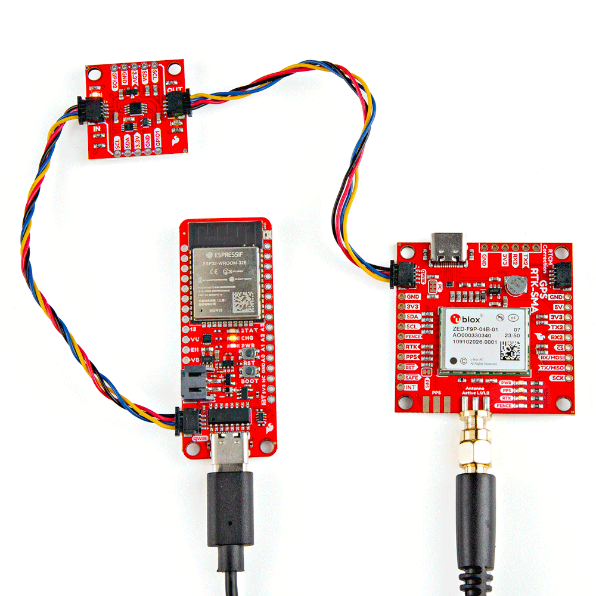

Now that we have our library and board add-on installed, we can start experimenting with the breakout board. For the scope of this tutorial, we will highlight the example in the Arduino Library to get started.


### Upload Arduino Example

After unzipping the compressed files, navigate to the example: **File** > **Examples** > **SparkFun Qwiic Power Switch Arduino Library** > **Example1_PowerOnOff**. This example allows you to toggle power and isolate the I<sup>2</sup>C lines for the OUT port through a serial terminal. The example also allows you to read GPIO1 and GPIO2.

For users using an Arduino microcontroller, select your board in the Tools menu (in our case the **SparkFun ESP32 Thing Plus C**) and the correct Port it enumerated on.

You can also copy or paste the code as shown below. Then click "Upload".

``` c++
    /*
      Using the Qwiic Power Switch
      By: Paul Clark (PaulZC)
      Date: April 23rd, 2020

      Based extensively on:
      Using the PCA9536 -- Digital Output
      By: Jim Lindblom
      SparkFun Electronics
      Date: May 4, 2018

      License: This code is public domain but you buy me a beer if you use this and we meet someday (Beerware license).

      This example demonstrates how to use the Qwiic Power Switch and read the additional GPIO pins

      Hardware Connections:
      Attach your Arduino to the Qwiic Power Switch IN
      Plug your Qwiic device into the Qwiic Power Switch OUT
      https://www.sparkfun.com/products/15081
    */

    #include <Wire.h>

    #include <SparkFun_Qwiic_Power_Switch_Arduino_Library.h>

    QWIIC_POWER mySwitch;

    void setup(void)
    {
      Serial.begin(115200);
      while (!Serial)
        ; //Wait for user to open terminal
      Serial.println(F("Qwiic Power Switch Example"));

      Wire.begin();

      if (mySwitch.begin() == false) //Connect to the power switch using Wire port
      {
        Serial.println(F("Qwiic Power Switch not detected at default I2C address. Please check wiring. Freezing."));
        while (1)
          ;
      }

      // Configure GPIO1 and GPIO2 as INPUT
      mySwitch.pinMode(1, INPUT);
      mySwitch.pinMode(2, INPUT);

      Serial.println(F("1) Enable power and I2C"));
      Serial.println(F("2) Disable power and I2C"));
      Serial.println(F("3) Enable I2C isolation"));
      Serial.println(F("4) Disable I2C isolation"));
    }

    void loop()
    {
      if (Serial.available())
      {
        byte incoming = Serial.read();

        if (incoming == '1')
        {
          // Switch the power on
          mySwitch.powerOn();
          Serial.println(F("Power is ON. I2C isolation is disabled."));
        }
        else if (incoming == '2')
        {
          // Switch the power off
          mySwitch.powerOff();
          Serial.println(F("Power is OFF. I2C isolation is enabled."));
        }
        else if (incoming == '3')
        {
          // Enable I2C isolation = I2C bus _is_ isolated
          mySwitch.isolationOn();
          Serial.println(F("I2C isolation enabled. I2C is isolated."));
        }
        else if (incoming == '4')
        {
          // Disable I2C isolation = I2C bus _is not_ isolated
          mySwitch.isolationOff();
          Serial.println(F("I2C isolation disabled. I2C is not isolated."));
        }

        // Read and print the GPIO1/GPIO2 state
        Serial.print(F("GPIO1 is: "));
        Serial.println(mySwitch.digitalRead(1));
        Serial.print(F("GPIO2 is: "));
        Serial.println(mySwitch.digitalRead(2));

        // Read any extra Serial bytes (e.g. CR or LF)
        while (Serial.available() > 0)
        {
          Serial.read();
        }
      }
    }

```

!!! tip
    Instead of reading GPIO1 and GPIO2, you can write to the GPIO pins to set the pins HIGH or LOW. You will need to change the following lines of code in the `setup()` and `loop()` functions where the GPIO1 and GPIO2 are initialized and read.

    ``` c++
    setup(){
      .
      .
      .
      // Configure GPIO1 and GPIO2 as INPUT
      mySwitch.pinMode(1, INPUT);
      mySwitch.pinMode(2, INPUT);
      .
      .
      .
    }

    void loop() {
          .
          .
          .
          // Read and print the GPIO1/GPIO2 state
          Serial.print(F("GPIO1 is: "));
          Serial.println(mySwitch.digitalRead(1));
          Serial.print(F("GPIO2 is: "));
          Serial.println(mySwitch.digitalRead(2));
          .
          .
          .
    }
    ```

    Instead of an INPUT, you will change each GPIO pin as an OUTPUT. Additionally, you will need to set the pin as a HIGH or LOW.

    ``` c++
    setup(){
      .
      .
      .
      // Configure GPIO1 and GPIO2 as OUTPUT
      mySwitch.pinMode(1, OUTPUT);
      mySwitch.pinMode(2, OUTPUT);
      .
      .
      .
    }

    void loop() {
          .
          .
          .
          // Write to GPIO1 & GPIO2
          Serial.println(F("GPIO1 is set to HIGH."));
          mySwitch.digitalWrite(1, HIGH);
          Serial.println(F("GPIO2 is set to LOW."));
          mySwitch.digitalWrite(2, LOW);
          .
          .
          .
    }
    ```

    To test, simply attach an LED with a current limiting resistor between the GPIO and GND. The LED should light up when the pin is HIGH and turn off when set to LOW. Of course, you can also connect a multimeter set to read the voltage between the GPIO pin nd GND. The GPIO pin should read 3.3V when set to HIGH and 0V when set to LOW.


After uploading the code, open the [Serial Monitor](https://learn.sparkfun.com/tutorials/terminal-basics) or terminal emulator of your choice with the baud rate set to **115200**. You will be presented with a few options to configure the Qwiic Power Switch:

* <kbd>1</kbd> &mdash; Power is ON I2C isolation is disabled.
* <kbd>2</kbd> &mdash; Power is OFF. I2C isolation is enabled.
* <kbd>3</kbd> &mdash; I2C isolation enabled. I2C is isolated.
* <kbd>4</kbd> &mdash; I2C isolation disabled. I2C is not isolated.

<div style="text-align: center;">
  <table>
    <tr style="vertical-align:middle;">
     <td style="text-align: center; vertical-align: middle; border: solid 1px #cccccc;"><a href="../assets/img/Qwiic_Power_Switch_Configuration_Arduino ESP32.JPG"></a></td>
    </tr>
    <tr style="vertical-align:middle;">
     <td style="text-align: center; vertical-align: middle; border: solid 1px #cccccc;"><i>Qwiic Power Switch Configuration with Arduino ESP32</i></td>
    </tr>
  </table>
</div>


Let&apos;s send a <kbd>2</kbd> to turn power off the Qwiic Power Switch&apos;s output and isolate the I<sup>2</sup>C data and clock lines. The Arduino will output a message: "Power is OFF. I2C isolation is enabled." The Arduino will also read the Qwiic Power Switch's GPIO1 and GPIO2. In this case, there was nothing connected to either GPIO so the pin reading was `1` indicating a HIGH. If there was a logic LOW, the pin would read `0` indicating a LOW.

<div style="text-align: center;">
  <table>
    <tr style="vertical-align:middle;">
     <td style="text-align: center; vertical-align: middle; border: solid 1px #cccccc;"><a href="../assets/img/Qwiic_Power_Switch_Configuration_Arduino ESP32_OFF_Isolated.JPG"></a></td>
    </tr>
    <tr style="vertical-align:middle;">
     <td style="text-align: center; vertical-align: middle; border: solid 1px #cccccc;"><i>Qwiic Power Switch Output OFF, I<sup>2</sup>C Isolated, and GPIO Readings with Arduino ESP32</i></td>
    </tr>
  </table>
</div>

If the Qwiic-enabled board includes a built-in LED, you can see if power is enabled. The power LED (as well as any other LED on the board) should have turned off as soon as power is disabled at the OUT port. In this case, the Qwiic Power Switch's OUT and ZED-F9P's LEDs when power was disabled and I<sup>2</sup>C isolation is enabled.

<div style="text-align: center;">
  <table>
    <tr style="vertical-align:middle;">
     <td style="text-align: center; vertical-align: middle; border: solid 1px #cccccc;"><a href="../assets/img/PRT-26787_Qwiic_Power_Switch_LOUT_ZED-F9P_LEDs_Turning_OFF.gif"></a></td>
    </tr>
    <tr style="vertical-align:middle;">
     <td style="text-align: center; vertical-align: middle; border: solid 1px #cccccc;"><i>Qwiic Power Switch OUT and ZED-F9P LEDs Turning OFF</i></td>
    </tr>
  </table>
</div>

!!! note
    If power is OFF at the OUT port but you decide to disable I<sup>2</sup>C isolation, you may notice a voltage at the 3.3V OUT pin from the pull-up resistors connected to the I<sup>2</sup>C lines.

If you would like to verify that the I<sup>2</sup>C lines are isolated, try turning the power back on by sending a <kbd>1</kbd> and then sending a <kbd>3</kbd> to isolate the I<sup>2</sup>C lines. While still applying power to the Qwiic Power Switch, try re-uploading code to the Arduino for the Qwiic-enabled board that is connected to the Qwiic Power Switch's OUT. Assuming that the example code checks for the Qwiic-enabled device, you should receive a message indicating that the Qwiic-enabled device was not detected.

!!! note
    Of course, you could also use the [Arduino I2C scanner](https://playground.arduino.cc/Main/I2cScanner/) to scan the I<sup>2</sup>C bus and detect I<sup>2</sup>C devices. When scanning, you should only see the Qwwic Power Switch and anything that was connected before the IN port. Anything after the OUT will not be detected on the OUT port if power was disabled or the lines were isolated.
