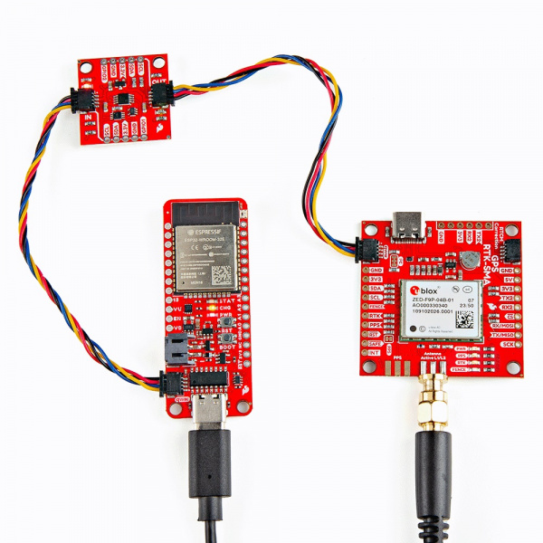

In this section, we will go over how to connect to the Qwiic Power Switch.

### Connecting Via Qwiic

Insert a Qwiic cable between your Arduino microcontroller and the Qwiic Power Switch&apos;s IN port. In this case, we used the SparkFun Thing Plus ESP32- USB-C for the Arduino microcontroller. Then connect Qwiic cable between the Qwiic Power Switch's OUT port to the second Qwiic-enabled device. In this case, we used the ZED-F9P SMA breakout board when toggling power and isolating the I2C lines. We also connected an external multiband antenna to the ZED-F9P. When ready, connect a USB cable to the Arduino to program, power, and control the Qwiic Power Switch through a serial terminal.

  <table>
    <tr style="vertical-align:middle;">
     <td style="text-align: center; vertical-align: middle; border: solid 1px #cccccc;"></td>
    </tr>
    <tr style="vertical-align:middle;">
     <td style="text-align: center; vertical-align: middle; border: solid 1px #cccccc;"><i>Thing Plus ESP32, Qwiic Power Switch, ZED-F9P Connected via Qwiic</i></td>
    </tr>
  </table>

!!! note
    To isolate any Qwiic-enabled device, you will need to connect the Qwiic-enabled device from the OUT port.

### Connecting via PTH

For temporary connections to the PTHs, you could use IC hooks to test out the pins. However, you'll need to solder headers or wires of your choice to the board for a secure connection. You can choose between a combination of [header pins and jumper wires](https://learn.sparkfun.com/tutorials/how-to-solder-through-hole-soldering/all), or [stripping wire and soldering the wire](https://learn.sparkfun.com/tutorials/working-with-wire/all) directly to the board.

-   <a href="https://learn.sparkfun.com/tutorials/how-to-solder-through-hole-soldering/all">
      <figure markdown>
        
      </figure>
    </a>

    ---

    <a href="https://learn.sparkfun.com/tutorials/how-to-solder-through-hole-soldering/all">
      <b>How to Solder: Through Hole Soldering</b>
    </a>
<!-- ----------WHITE SPACE BETWEEN GRID CARDS---------- -->

-   <a href="https://learn.sparkfun.com/tutorials/working-with-wire/all">
      <figure markdown>
        
      </figure>
    </a>

    ---

    <a href="https://learn.sparkfun.com/tutorials/working-with-wire/all">
      <b>Working with Wire</b>
    </a>
<!-- ----------WHITE SPACE BETWEEN GRID CARDS---------- -->

