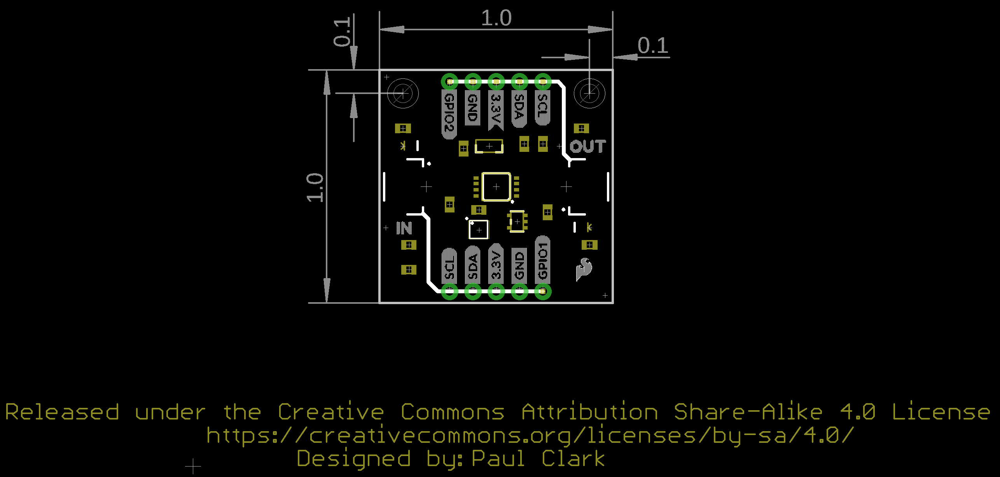

In this section, we will highlight the hardware and pins that are broken out on the SparkFun Qwiic Power Switch. For more information, check out our [Resources and Going Further](../resources/) on the components used on the breakout board.

  <table>
    <tr style="vertical-align:middle;">
     <td style="text-align: center; vertical-align: middle; border: solid 1px #cccccc;"></td>
     <td style="text-align: center; vertical-align: middle; border: solid 1px #cccccc;"></td>
    </tr>
    <tr style="vertical-align:middle;">
     <td style="text-align: center; vertical-align: middle; border: solid 1px #cccccc;"><i>Top View</i></td>
     <td style="text-align: center; vertical-align: middle; border: solid 1px #cccccc;"><i>Bottom View</i></td>
    </tr>
  </table>

### Power

To power the board, we recommend applying 3.3V to the 3.3V pin on the side labeled IN. While the IC's operating voltage is 2.3V to 5.5V, we recommend limiting the input voltage to 3.3V for the Qwiic Connect System. Below are the power pins that are broken out on the edge of the board.

* **IN - 3.3V** &mdash; This pin is the voltage input for the board. The recommended input voltage for this pin is 3.3V.
* **OUT - 3.3V** &mdash; This pin is the voltage output for the board. When the PCA9536 GPIO0 enables the transistor, any Qwiic enabled device that is connected to this side of the board will be powered by 3.3V.
* **GND** &mdash; Of course, is the common, ground voltage (0V reference) for the system.

  <table>
    <tr style="vertical-align:middle;">
     <td style="text-align: center; vertical-align: middle; border: solid 1px #cccccc;"></td>
    </tr>
    <tr style="vertical-align:middle;">
     <td style="text-align: center; vertical-align: middle; border: solid 1px #cccccc;"><i>Power, Ground, Transistor, and Qwiic Connector Highlighted</i></td>
    </tr>
  </table>

### Qwiic and I2C

The board includes two horizontal Qwiic connectors to connect Qwiic-enabled I2C devices. However, the board still breaks out 0.1"-spaced pins for users who prefer a soldered connection. The PCA9306 dual bidirectional I2C bus voltage level translator (the 8-pin IC closer to IN by the SDA and 3.3V PTHs) is included between the input and output Qwiic connectors. This acts as a bus isolator between the input and output pins for the data and clock lines. This prevents the pull-up resistors from feeding parasitic power to your Qwiic-enabled boards. The Qwiic Power Switch can also be used to isolate a 400kHz bus from a 100kHz bus; the slower bus on the output of the Qwiic Power Switch can be disconnected during fast-mode communication without disabling power.

* **IN**
    * **SCL** &mdash; I2C clock on the PCA9306&apos;s input side.
    * **SDA** &mdash; I2C data on the PCA9306&apos;s input side.
    * **3.3V** &mdash; This pin is the voltage input for the board. The recommended input voltage for this pin is 3.3V.
* **OUT**
    * **SCL** &mdash; I2C clock on the PCA9306&apos;s output side.
    * **SDA** &mdash; I2C data on the PCA9306&apos;s output side.
    * **3.3V** &mdash; This pin is the voltage output for the board. When the PCA9536 GPIO0 enables the transistor, any Qwiic enabled device that is connected to this side of the board will be powered by 3.3V.
* **GND** &mdash; Of course, is the common, ground voltage (0V reference) for the system. The GND PTHs are connected to both IN and OUT.

  <table>
    <tr style="vertical-align:middle;">
     <td style="text-align: center; vertical-align: middle; border: solid 1px #cccccc;"></td>
    </tr>
    <tr style="vertical-align:middle;">
     <td style="text-align: center; vertical-align: middle; border: solid 1px #cccccc;"><i>Qwiic Connector, I2C, and PCA9306 Highlighted</i></td>
    </tr>
  </table>

Connected on the input I2C bus is the TI PCA9536 4-Bit I2C I/O Expander (the bigger 8-pin IC located at the center of the board). This IC is used to toggle output 3.3V power and the PCA9306 I2C isolation. Its I2C device's 7-bit unshifted address is **0x41**.

### PCA9536 and GPIO Pins

The PCA9536 is a 4-bit GPIO IC that enables users to toggle the following GPIO pins through I2C. The I2C address of the PCA9536 is **0x41**.

* **GPIO0** &mdash; GPIO0 is connected to the MOSFET power switch. This controls the voltage between the 3.3V input pin and VOUT. When this transistor is turned off, power is removed from the I2C output's pull-up resistors.
* **GPIO1** &mdash; GPIO1 is an extra GPIO pin.
* **GPIO2** &mdash; GPIO2 is an extra GPIO pin.
* **GPIO3** &mdash; This pin is connected to the PCA9306. This allows you to isolate the I2C output.

  <table>
    <tr style="vertical-align:middle;">
     <td style="text-align: center; vertical-align: middle; border: solid 1px #cccccc;"></td>
    </tr>
    <tr style="vertical-align:middle;">
     <td style="text-align: center; vertical-align: middle; border: solid 1px #cccccc;"><i>PCA9536 and GPIO Pins Highlighted</i></td>
    </tr>
  </table>

### LEDs

The board includes two LEDs to indicate when power is available on the input and output's 3.3.V pins. Both can be disabled with the jumpers on the back of the board.

  <table>
    <tr style="vertical-align:middle;">
     <td style="text-align: center; vertical-align: middle; border: solid 1px #cccccc;"></td>
    </tr>
    <tr style="vertical-align:middle;">
     <td style="text-align: center; vertical-align: middle; border: solid 1px #cccccc;"><i>LEDs Highlighted</i></td>
    </tr>
  </table>

### Jumpers

!!!note
    If this is your first time working with jumpers, check out the [How to Work with Jumper Pads and PCB Traces](https://learn.sparkfun.com/tutorials/how-to-work-with-jumper-pads-and-pcb-traces/all) tutorial for more information.

The back of the board includes jumpers to configure the board.

* **I2C IN** &mdash; By default, this three-pad jumper is closed. The three way jumper labeled I2C IN connects 3.3V to two 2.2k&ohm; pull-up resistors and to the I2C data and clock lines. If multiple devices are connected to the bus with the pull-up resistors enabled, the parallel equivalent resistance will create too strong of a pull-up for the bus to operate correctly. As a general rule of thumb, [disable all but one pair of pull-up resistors](https://learn.sparkfun.com/tutorials/i2c/all#i2c-at-the-hardware-level) if multiple devices are connected to the bus.
* **I2C OUT** &mdash; By default, this three-pad jumper is closed. Similar to the I2C IN jumper, this jumper is connects the VOUT net to two 2.2k&ohm; pull-up resistors and to the I2C data and clock lines. This VOUT is controlled by a MOSFET power switch and PCA9536's GPIO0. When the transistor is turned on, VOUT will connect to the input 3.3V pin.
* **LED IN** &mdash; By default, this jumper connects the LED to the input's 3.3V pin.. Cutting this trace disables the LED.
* **LED OUT** &mdash; By default, this jumper connects the LED to the output's 3.3V pin. Cutting this trace disables the LED.

  <table>
    <tr style="vertical-align:middle;">
     <td style="text-align: center; vertical-align: middle; border: solid 1px #cccccc;"></td>
    </tr>
    <tr style="vertical-align:middle;">
     <td style="text-align: center; vertical-align: middle; border: solid 1px #cccccc;"><i>Jumpers Highlighted</i></td>
    </tr>
  </table>

### Board Dimensions

The board is 1.0" x 1.0" (25.4mm x 25.4mm). There are 2x mounting holes. You can use 4-40 standoffs to mount the board to a panel or enclosure.

  <table>
    <tr style="vertical-align:middle;">
     <td style="text-align: center; vertical-align: middle; border: solid 1px #cccccc;"></td>
    </tr>
    <tr style="vertical-align:middle;">
     <td style="text-align: center; vertical-align: middle; border: solid 1px #cccccc;"><i>Board Dimensions</i></td>
    </tr>
  </table>

